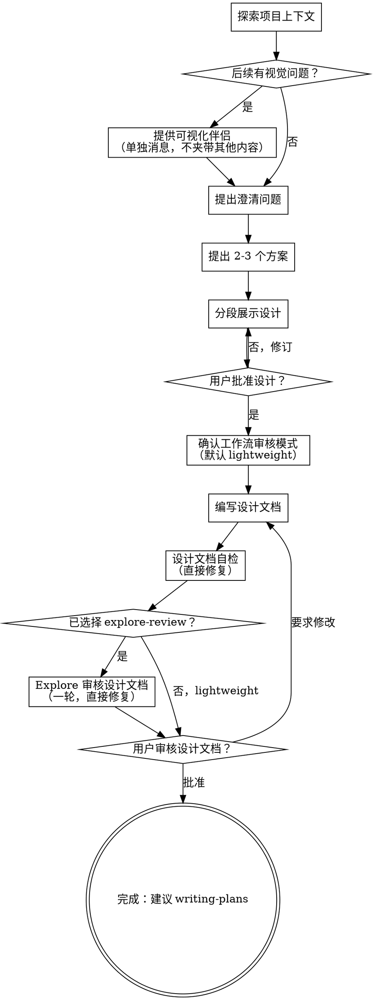

# 把想法梳理成设计

通过自然协作式对话，把初始想法转化为清晰、可落地的设计和规格文档。

先理解当前项目上下文，再一次只问一个问题来逐步收敛想法。确认你已经理解要构建什么之后，展示设计方案并获得用户认可。

<HARD-GATE>
在展示设计并获得用户批准之前，不要写任何代码、不要搭建项目、不要执行任何实现动作。无论任务看起来多简单，这条都适用。

例外：如果用户同意使用可视化伴侣，可以创建临时 HTML mockup 或图示文件辅助讨论。这些是设计讨论工件，不是生产代码，不得当作实现成果提交。
</HARD-GATE>

## 反模式：“这太简单了，不需要设计”

每个项目都要走这个流程。待办清单、单函数工具、配置变更，也都一样。“简单”任务最容易因为未经检查的假设造成返工。真正简单的任务设计可以很短，几句话就够，但必须先展示设计并获得批准。

## 检查清单

按顺序执行这些步骤。用户要求或工作流确实需要时，创建任务清单：

1. **探索项目上下文** — 查看文件、文档、近期提交
2. **提供可视化伴侣** — 如果后续会涉及视觉问题，单独发送这个提议，不要和澄清问题混在一起。见后文“可视化伴侣”
3. **提出澄清问题** — 一次只问一个，理解目的、约束和成功标准
4. **提出 2-3 个方案** — 说明取舍，并给出你的推荐
5. **展示设计** — 按复杂度分段展示，每段之后获取用户确认
6. **确认工作流审核模式** — 除非用户更早已明确指定，否则在生成设计文档前让用户一次性选择：`lightweight`（默认）或 `explore-review`
7. **编写设计文档** — 保留对话中的完整推理链，然后保存到 `docs/specs/YYYY-MM-DD-<topic>-design.md`。如果用户要求或项目流程需要，再提交到 git
8. **设计文档自检** — 快速检查占位符、矛盾、歧义和范围问题
9. **可选 explore 设计文档审核** — 如果当前模式是 `explore-review`，立即运行一轮 explore 设计文档审核并直接修复
10. **用户审核设计文档** — 请用户先审核设计文档，再进入下一步
11. **建议 writing-plans** — 建议用户使用 writing-plans skill 生成执行计划，由用户决定是否继续

## 流程图



**终态是用户批准后的设计文档。** 建议把 writing-plans 作为自然下一步，但不要自动调用任何 skill。

## 具体流程

**理解想法：**

- 先查看当前项目状态，包括文件、文档和近期提交
- 在追问细节前先评估范围。如果用户请求包含多个独立子系统，例如“做一个带聊天、文件存储、计费和分析的平台”，要立刻指出需要拆分。不要在一个本该拆分的大项目上继续追细节
- 如果项目太大，不适合一个规格文档，帮用户拆成多个子项目：哪些部分相互独立、它们如何关联、应该按什么顺序构建。然后按正常设计流程推进第一个子项目。每个子项目都走自己的 spec -> plan -> implementation 周期
- 对范围合适的项目，一次只问一个问题来收敛想法
- 尽量用选择题，必要时也可以用开放问题
- 只要你给出选项，例如澄清范围、体验方向、技术方案，就给出当前推荐并说明原因。不要让用户从不带倾向的选项列表里猜你的判断
- 每条消息只问一个问题；如果一个主题需要继续探索，就拆成多轮
- 重点理解目的、约束和成功标准

**探索方案：**

- 提出 2-3 个不同方案，并说明取舍
- 用对话方式展示选项，同时给出推荐和理由
- 先给出推荐方案，再解释为什么

**展示设计：**

- 当你认为已经理解要构建什么时，展示设计
- 按复杂度调整每个段落：简单的几句话即可，复杂的可以到 200-300 字左右
- 每段之后询问用户目前看起来是否正确
- 覆盖架构、组件、数据流、错误处理、测试
- 如果某处不清楚，随时回到澄清环节

**为隔离和清晰而设计：**

- 把系统拆成更小的单元。每个单元有清晰职责，通过明确接口沟通，并且能独立理解和测试
- 对每个单元，都应该能回答：它做什么、怎么使用、依赖什么
- 如果不读内部实现就无法理解一个单元，或无法在不破坏调用方的情况下修改内部实现，说明边界需要调整
- 小而清晰的单元也更适合你处理。对于能放进上下文的代码，你的推理更可靠；当文件职责集中时，编辑更可靠。文件变大往往意味着它承担了太多职责

**在现有代码库中工作：**

- 先探索当前结构，再提改动。遵循已有模式
- 如果现有代码的问题会影响这次工作，例如文件过大、边界不清、职责纠缠，把有针对性的改善纳入设计。优秀工程师会在自己改动的代码上做必要改善
- 不要提出无关重构。保持聚焦，只做服务当前目标的设计

## 设计之后

**文档：**

- 将已验证的设计（spec）写入 `docs/specs/YYYY-MM-DD-<topic>-design.md`
- 如果用户偏好其他 spec 路径，以用户偏好为准
- 设计文档不只是最终答案。它必须成为头脑风暴对话的持久化总结：问过什么、用户怎么回答、考虑过哪些选项、做了哪些决定，以及为什么
- 如果用户要求或项目流程需要，将设计文档提交到 git

**设计文档必备内容：**
每份设计文档都应包含这些章节，并按功能大小调整篇幅。即使是很小的改动，也要保留推理链，不要省略。

状态字段必须写入单个实际值，不要在最终文档中保留多个候选值或条件说明。

```markdown
# [功能名称] 设计

**工作流审核模式（Workflow Review Mode）：** `lightweight`

**规格审核状态（Spec Review Status）：** `lightweight`

## 摘要
[简要描述最终设计和用户可见结果。]

## 问题与目标
[要解决什么问题、面向谁、成功意味着什么。]

## 上下文
[相关项目结构、既有模式、约束、依赖，以及从代码库/文档中发现的事实。]

## 头脑风暴记录
[总结头脑风暴中讨论过的所有关键问题。包含用户回答，以及你在设计中采用的解释。按主题归类，不要粘贴原始聊天记录。]

## 考虑过的方案
[列出探索过的 2-3 个方案/选项、各自取舍，以及为什么选择最终方案。]

## 设计决策
[用表格或列表记录：决策、理由、被拒绝的替代方案、影响。包括所有会影响实现的决策。]

## 最终设计
[按需覆盖架构、组件、数据流、UX/API 行为、错误处理、权限/安全、持久化和集成点。]

## 不在范围内
[明确说明现在不做什么，尤其是头脑风暴中提到但延期的想法。]

## 未决问题
[只列出确实仍未解决的问题。如果没有，写“无”。不要留下 TBD。]

## 测试与验收
[高层验证策略和具体验收标准。详细实现步骤属于执行计划，但设计文档必须定义什么叫“完成”。]
```

**头脑风暴记录写法：**

- 记录每个关键问题或讨论点，即使最终结论是“不做”或“延期”
- 对对话做总结和归类，不要贴原始聊天记录
- 保留设计意图：未来实现者只读设计文档，也应该理解为什么最终设计是这样
- 如果可视化伴侣中的选择、浏览器点击或视觉反馈影响了设计，也要记录
- 如果某个主题被考虑但被拒绝，把它写到“考虑过的方案”“设计决策”或“不在范围内”，避免后续重复讨论

**设计文档自检：**
写完设计文档后，换个视角重新检查：

1. **占位符扫描：** 是否还有 “TBD”、“TODO”、未完成章节或含糊需求？修复
2. **内部一致性：** 章节之间是否矛盾？架构是否匹配功能描述？
3. **范围检查：** 是否聚焦到足以进入单个执行计划？还是需要拆分？
4. **歧义检查：** 某个需求是否可能被两种方式理解？如果是，选定一种并写清楚
5. **对话覆盖：** 设计文档是否体现了所有关键问题、用户回答、方案、取舍和最终决策？补齐遗漏
6. **决策可追溯：** 每个非显然设计选择，读者是否能看到理由和被拒绝的替代方案？如果不能，补上
7. **验收清晰度：** 成功标准是否足够具体，能让 writing-plans 转成可执行检查？如果不够，收紧表述

直接修复发现的问题，不需要再单独 review 一遍。

**工作流审核模式：**
审核模式要在**生成设计文档前**确定，并写入设计文档头部。不要等写完文档再给用户“补选一次”。如果用户在更早的对话里已经明确说了“快速 / 轻便 / 不用 subagent”或明确要求 `explore-review`，直接沿用；否则就在写设计文档前做一次二选一确认。

建议话术：

> “生成设计文档前先确认审核模式：默认是 `lightweight`（不使用 subagent）；如果你选择 `explore-review`，设计文档、执行计划和代码实现这三个阶段都会各自动运行一轮 explore 审核和修复（会多消耗一些 token，但更严格），中间我不会再重复询问。若你不特别选择，我就按 `lightweight` 继续。”

模式行为：

- `lightweight`：跳过 subagent 审核，进入用户审核关口。在设计文档中写入 `Workflow Review Mode: lightweight` 和 `Spec Review Status: lightweight`
- `explore-review`：这是全链路模式。在设计文档中写入 `Workflow Review Mode: explore-review`。设计文档自检后立即运行一轮 explore subagent 设计文档审核；之后 writing-plans 必须自动运行一轮计划审核，executing-plans 必须自动运行一轮实现审核。不要在后续阶段再次询问用户是否开启审核
- 默认每个阶段只运行一轮“审核 -> 修复 -> 自检/复验”。除非用户明确要求多轮审核，例如“再审一轮”“循环审核直到没有问题”，否则不要因为修复完成、用户后续改动或 reviewer 还可能提出新意见，就自动追加第二轮
- 如果用户说“快速”“轻便”“不使用 subagent”等等，使用 `lightweight`
- 如果用户明确要求额外、独立、subagent 或 explore 审核，例如“用 explore 审核”“让 subagent double check”，使用 `explore-review`，整条链路每个产物/阶段各一轮审核修复。普通“请 review 文档”不自动等同于 `explore-review`，按上下文判断，必要时简短确认
- 一旦选择 `explore-review`，把该模式持久化到设计文档；后续 `writing-plans` 和 `executing-plans` 必须直接继承，不再主动询问，除非用户明确改模式

`Spec Review Status` 可用值：`lightweight`、`explore-reviewed`、`needs-review-after-changes`、`not recorded`（`not recorded` 仅用于没有设计文档、用户跳过 spec 的场景）。只有当前最终版设计文档已经被 explore 审核覆盖时，才能使用 `explore-reviewed`。

Explore 审核提示词模式：

实际派发 explore review 时，以同目录的 `spec-document-reviewer-prompt.md` 为 canonical 提示词；下方是内联摘要，方便理解审核重点。若两者冲突，以 `spec-document-reviewer-prompt.md` 为准。

```text
审核这份设计文档，判断它是否已经准备好进入实现计划阶段。

设计文档：[SPEC_FILE_PATH]

使用中等深入程度。不要编辑文件。只关注会实质影响计划或实现的问题：
- 头脑风暴对话中的需求或决策是否遗漏
- 设计决策是否不清晰或互相矛盾
- 是否缺少理由、被拒绝的替代方案或范围边界
- 验收标准是否过于含糊，无法转成执行计划
- 是否存在范围蔓延或过度设计

只返回可执行发现，按严重程度排序，附文件/章节引用和建议修复方式。
```

如果修复不违背已批准设计，就直接应用到设计文档。若 reviewer 建议会改变范围、违背用户决策，或需要新的产品/设计选择，先问用户再改。修复后重新跑一遍设计文档自检，将 `Spec Review Status` 设为 `explore-reviewed`，然后进入用户审核关口。

`Spec Review Status: explore-reviewed` 只表示当前版本曾被这一轮 explore 审核覆盖。如果之后又发生实质性修改，把状态改回 `needs-review-after-changes` 并重新运行自检；按前文“默认只一轮”规则，除非用户明确要求多轮，否则不自动再跑 explore 审核（纯错别字或格式修正也不需要重新审核）。

**用户审核关口：**
设计文档自检和可选审核通过后，请用户审核已写入文件的设计文档：

> “设计文档已写入 `<path>`。请先审核，如果要改动，告诉我；确认后再进入下一步。”

等待用户回复。如果用户要求修改，修改后重新运行设计文档自检。只有用户批准后才继续。

如果用户修改发生在 explore 审核之后，按上面的状态规则处理，确保最终设计文档的 `Spec Review Status` 不会声称覆盖了未经审核的实质改动。

**下一步：**

- 建议用户使用 writing-plans skill 创建详细执行计划
- 不要自动调用任何 skill；让用户决定何时以及如何继续

## 核心原则

- **一次只问一个问题** - 不要用多个问题压垮用户
- **优先选择题** - 合适时，选择题比开放问题更容易回答
- **选项必须有判断** - 只要给出选择，就附带你的推荐和理由
- **严格 YAGNI** - 从所有设计中移除不必要功能
- **探索替代方案** - 定案前总是提出 2-3 个方案
- **增量确认** - 展示设计并获得批准后再继续
- **保留推理链** - 设计文档必须记录头脑风暴中的问题、决策和取舍，而不只是最终架构
- **审核模式可继承** - `lightweight` 是默认值；如果用户选择 `explore-review`，设计文档、执行计划、代码实现都会各进行一轮 explore 审核；默认不自动扩展成多轮
- **保持灵活** - 如果不清楚，就回到澄清环节

## 可视化伴侣

一个基于浏览器的头脑风暴辅助工具，用于展示 mockup、图表和视觉选项。它是一个工具，不是工作模式。用户接受可视化伴侣，只表示遇到适合视觉呈现的问题时可以使用；不表示每个问题都必须通过浏览器处理。

**提出可视化伴侣：** 当你预计后续问题会涉及视觉内容（mockup、布局、图表）时，先单独征求同意：
> “我们接下来讨论的一些内容，可能用浏览器展示会更容易理解。我可以边讨论边做 mockup、图表、对比方案和其他可视化内容。这个功能还比较新，也可能比较消耗 token。要试试看吗？（需要打开一个本地 URL）”

**这个提议必须单独成一条消息。** 不要和澄清问题、上下文总结或其他内容混在一起。消息里只能有上面的提议。等待用户回复。如果用户拒绝，就继续纯文本头脑风暴。

**逐问题判断：** 即使用户同意，也要对每个问题单独判断使用浏览器还是终端。判断标准是：**用户看见它会不会比只读文字更容易理解？**

- **使用浏览器**：内容本身是视觉的，例如 mockup、线框图、布局对比、架构图、并排视觉设计
- **使用终端**：内容是文本的，例如需求问题、概念选择、取舍列表、A/B/C/D 文本选项、范围决策

关于 UI 的问题不一定就是视觉问题。“这里的个性是什么意思？”是概念问题，走终端。“哪种向导布局更合适？”是视觉问题，走浏览器。

如果用户同意使用可视化伴侣，继续前先阅读详细指南：
`visual-companion.md`
